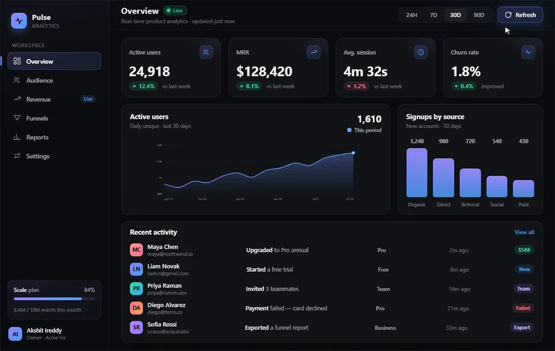
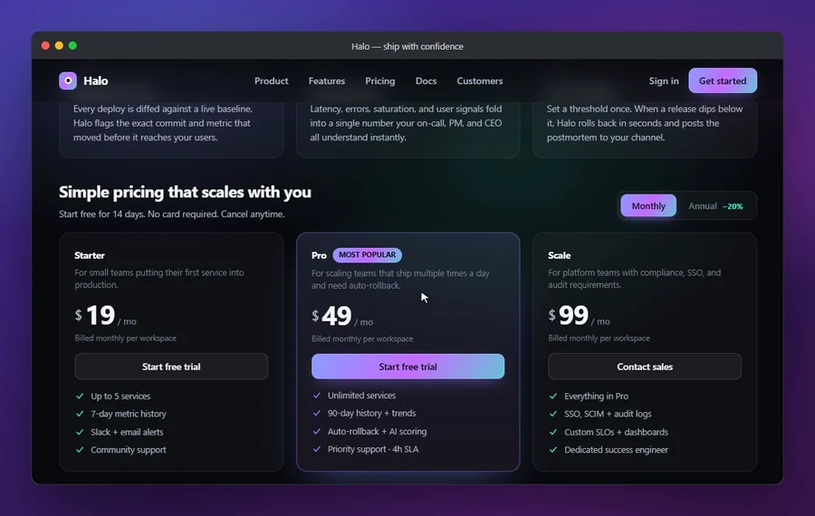

<div align="center">

# gifsmith

### A movie-set framework for **browser/app demo GIFs** & WebPs

Script a walkthrough of any web (or webview-desktop) UI as a declarative timeline, and get a tiny, smooth, **seamless forward-looping** README GIF/WebP. Like [vhs](https://github.com/charmbracelet/vhs), but for GUI apps.


<sub>↑ generated by gifsmith from the bundled example — <code>npm run example</code></sub>

</div>

---

gifsmith is a **framework, not a one-shot recorder**. Capture and encode are commodity (and bundled); the value is the direction model: a **movie set** (stage, props, camera, a synthetic cursor), a **declarative timeline** that makes multi-phase scenes tractable, an **app-cooperation bridge** to drive your product's real engine, a **seamless forward loop** (no ping-pong reversal), **natural pacing** (holds breathe, motion flows), and **AI-agent authoring ergonomics** so a coding agent can build and self-correct a demo without eyeballing a video.

```ts
import { render, timeline, web } from 'gifsmith';
import { cursor, bezel } from 'gifsmith/props';

const tl = timeline((t) => {
  t.waitFor('.app');
  t.hold(1.4);
  t.loopAnchor();            // the neutral state the scene returns to
  t.click('.generate');      // drive the real UI
  t.waitFor('.card');
  t.hold(1.7);
  t.click('.card');
  t.scroll('.content', 460, 3.0);   // slow, eased read-scroll
  t.scroll('.content', -460, 1.6);
  t.click('.back');          // ...back to where we started
  t.hold(1.5);
});

await render({
  target: web('http://localhost:5173'),
  out: 'docs/demo.gif',
  alsoEmit: ['webp'],
  props: [cursor(), bezel()],
  timeline: tl,
  encode: { width: 900, fps: 16, speed: 1.35, targetMB: 4 },
});
```

## Why this exists

"Web page → GIF" is a crowded space (see [Alternatives](#alternatives)). gifsmith aims at the intersection that none of them combine:

1. **A movie-set direction model** that drives the app's own internals and composes a staged environment *around* the real UI — not passive pixel capture.
2. **A seamless _forward_ loop** — a half-period self-crossfade (or a scripted-anchor trim), never a boomerang that reverses your motion.
3. **Natural pacing** from real per-frame timestamps — holds hold, motion flows — instead of a robotic constant-fps sampling.
4. **AI-author ergonomics** — every build helper returns structured JSON, plus an MCP server, so an agent (Claude Code, etc.) drives it as tools.

## Install

```bash
npm i -D gifsmith
```

Two things gifsmith uses but does **not** bundle (both are large native binaries you likely already have):

- A **Chromium-based browser** — Chrome / Edge / Brave, auto-detected. (No Chromium download; it depends on `puppeteer-core`.) Or set `PUPPETEER_EXECUTABLE_PATH`.
- **[ffmpeg](https://ffmpeg.org/)** on your `PATH` (or `FFMPEG_PATH`).

Check your setup: `npx gifsmith doctor`.

## The mental model — a movie set

| Primitive | What it is |
|---|---|
| **Stage** | the canvas: viewport size, DPI, background/theme |
| **Actors** | things that move — driven by gifsmith's tween system or your app's real engine |
| **Props** | reusable set-pieces: mock desktop, window frames, taskbar/dock, a synthetic cursor (`gifsmith/props`) |
| **Camera** | a clip/zoom region, so you capture a framed sub-view |
| **Timeline** | the heart: ordered beats with `hold`, named `cue`s, `parallel`/`sequence`, and a `loopAnchor` |
| **Director** | orchestrates connect → compose scene → run timeline while capturing → loop → encode |
| **Bridge** | a `window.__demo` handshake your app *opts into*, to expose state setters, actions, and a pace multiplier |

The declarative timeline is the direct fix for the usual demo-scripting failure: choreographing imperatively with racing promises. `"app does X, then the characters move"` becomes a readable, reproducible, introspectable list of beats.

## The seamless forward loop

Two strategies, auto-picked:

**Scripted-anchor trim** (`loop: 'anchor'`) — if your timeline marks a `loopAnchor()` (a neutral hold the scene returns to), gifsmith finds the best hold-to-hold seam by grayscale-thumbnail frame-MSE and trims to it. **Zero blending artifacts** — the last frame *is* the first frame. Best for scripted product demos. (The bundled example loops with a seam MSE of ~0.08.)

**Half-period self-crossfade** (`loop: 'crossfade'`) — for continuously-evolving/ambient motion that never returns to a pose, gifsmith blends each frame with its half-period counterpart under a raised-cosine weight:

```
out[i] = w[i]·frame[i] + (1 − w[i])·frame[(i + N/2) mod N]
w[i]   = 0.5·(1 − cos(2π·i/N))
```

`w` is 0 at the seam and 1 at the midpoint, so near the wrap the frame is dominated by the half-shifted stream — which is continuous across the loop point — and the result is mathematically periodic in `N` frames, with motion always moving **forward**. Slight ghosting on fast motion, so keep choreography gentle (calm reads better anyway).

`loop: 'auto'` (default) picks `anchor` when a `loopAnchor()` exists, else `crossfade`.

## Natural pacing

gifsmith captures with a CDP **screencast** (real paints, high fps) and keeps each frame's real timestamp. It builds an ffmpeg concat list with **per-frame durations**, then resamples to a uniform clock — so a 2-second hold becomes ~2 seconds of frames (which the palette encoder compresses to almost nothing) and motion keeps its true rhythm. This is CSS-animation-safe, unlike a virtual clock that only overrides JS timers. A tiny injected **heartbeat** guarantees frames keep flowing during otherwise-static holds, so their duration is timed accurately.

## Props

```ts
import { cursor, bezel, desktop, wallpaper, taskbar, mockWindow } from 'gifsmith/props';

props: [
  ...desktop({ os: 'windows' }),                 // wallpaper + taskbar
  mockWindow({ kind: 'code', x: 60, y: 80, width: 520, height: 340 }),
  cursor({ start: { x: 600, y: 470 } }),
  bezel(),
]
```

Props composite with the *live* app in the same paint (back-layer props behind, front-layer on top). The synthetic **cursor** is driven by `cursorTo` / `click(via:'cursor')` and glides with real easing; click glides are **distance-aware** by default (~900px/s, clamped), so long travels stay watchable instead of teleporting — pin an exact time with `click(sel, { glideSeconds })`.

The **taskbar** renders a convincing populated desktop, not placeholders: original SVG app-icon glyphs (start, search, folder, globe browser, code editor, terminal, mail) plus, on Windows, a system tray — chevron, wifi, speaker, battery — beside the clock. `taskbar({ clock: '10:24', date: '7/13/2026' })` pins the time; the mac dock reuses the same icon set.

## Built for AI authors

Every build-time helper returns structured data — an agent can build and self-correct without watching a video:

```ts
import { probe, dryRun, snapshot, contactSheet, expectVisible } from 'gifsmith';

await probe({ target: web(url) });          // DOM map: selectors + bounding boxes, bridge status
await dryRun(scene);                        // selectors resolve? loop anchor? planned duration?
await snapshot(scene, 4.2);                 // one frame at t=4.2s (base64 PNG) — "see" a moment
await contactSheet(scene, 6);               // a tiled grid of N frames for one-shot visual QA
```

`render()` returns achieved fps, frame counts, output bytes, loop-seam MSE, and actionable warnings. Assertions (`expectVisible`, `expectStable`, `expectInFrame`) run inside a `t.call()` step so a broken scene fails loudly instead of shipping a blank GIF.

There's also an **MCP server** (`gifsmith-mcp`, experimental) exposing `probe` / `dry_run` / `contact_sheet` / `snapshot` / `render` as tools. Install the optional `@modelcontextprotocol/sdk` to use it.

## CLI

```bash
gifsmith render demo.config.mjs --width 900 --fps 16 --also-webp
gifsmith probe  http://localhost:5173 --json
gifsmith doctor
```

A config module default-exports a `RenderConfig` (the timeline is authored in code — vhs-`.tape` in spirit, fully programmable). CLI flags override its encode/loop options.

## Adapters

```ts
import { web, tauri, electron } from 'gifsmith';

web('http://localhost:5173')       // launch a detected browser (the supported v1 path)
tauri({ port: 9222 })              // attach to a running Tauri (WebView2) app
electron({ port: 9222 })           // attach to a running Electron app
```

For webview apps, launch with a remote-debugging port first. On **Windows/WebView2** the non-obvious gotcha is `--remote-allow-origins=*` — without it the CDP WebSocket 403s:

```powershell
$env:WEBVIEW2_ADDITIONAL_BROWSER_ARGUMENTS = "--remote-debugging-port=9222 --remote-allow-origins=*"
Start-Process .\your-app.exe
```

The [Cadence/Electron example](examples/electron-app/) is a complete, runnable attach recording (launch → attach → record) — the same flow applies to Tauri.

## Size budgeting & gotchas

- Knobs: `width`, `fps`, `speed`, `colors` (GIF palette), `quality` (WebP), `targetMB` (warns if exceeded); `camera` clips output to a sub-region.
- **Bayer (ordered) dither** for GIF, not error-diffusion — it keeps a static pattern frame-to-frame so inter-frame compression stays effective (the difference between ~25 MB and ~2 MB on a text UI).
- **WebP** is smaller and cleaner than GIF for modern READMEs; gifsmith emits both (`alsoEmit: ['webp']`). GitHub renders animated WebP inline.
- **Animated backgrounds wreck compression** — prefer a quiet background while recording.
- gifsmith runs headless/off-screen and muted, and never persists app state; if you toggle real state for a shot, restore it around the capture.

## Composition modes

`overlay` (default) drives the app at top level and injects props as DOM layers — robust for any app, and the full movie set for transparent/overlay apps.

`stage` renders the app inside an `<iframe>` as a **window on a mock desktop** (wallpaper + a titled window). The app is driven inside the frame — Puppeteer handles it even cross-origin — while the synthetic cursor and props live on the top page, with cursor coordinates mapped through the iframe offset. Stage mode needs an http(s) target (a dev server); a `file://` app can't be framed by a non-file page. See the [Halo example](examples/halo/).

```ts
await render({ target: web('http://localhost:5173'), out: 'demo.gif',
  compose: 'stage', stage: { title: 'My App', os: 'mac' }, timeline: tl });
```

The stage reserves space under the window (`stage.bottomInset`, default 72px windows / 84px mac) so a `taskbar()`/dock prop never overlaps the app and a strip of desktop stays visible between them — a window sitting flush on the taskbar reads as a bug, not a desktop. Set `bottomInset: 0` to restore the old edge-to-edge layout.

## Sandbox & isolation

gifsmith always renders in an **isolated, throwaway browser profile** — a fresh `userDataDir` it creates under a temp work dir and deletes afterwards — so a capture never reads or writes your real browser's cookies, session, or history. It runs headless, muted, and (headful) off-screen. For CI/containers, set `chromiumSandbox: false` on the target (adds `--no-sandbox`), and there's a [`Dockerfile`](Dockerfile) for hermetic, host-independent rendering (Chromium + ffmpeg baked in).

## Examples

A gallery of self-contained demos, each showing a different capability — see [`examples/`](examples/) for the full set and runnable sources.

| Demo | Shows |
|---|---|
| [Aurora](examples/hello-web/) | overlay mode · anchor loop · synthetic cursor |
| [Pulse](examples/pulse/) | cursor journey · re-animated dashboard · anchor loop |
| [Halo](examples/halo/) | **stage mode** — app as a window on a desktop |
| [Forge](examples/forge/) | **camera clip** on a CI pipeline · crossfade loop |
| [Cadence](examples/electron-app/) | the **`electron()` attach adapter** — a real Electron app, end-to-end |

<p>
  
  
</p>

## Alternatives

Honest landscape — reach for these when they fit better:

- **[vhs](https://github.com/charmbracelet/vhs)** — the gold standard for *terminal* demos via `.tape` scripts. Explicitly punts on the browser; gifsmith is the GUI analogue.
- **[Remotion](https://www.remotion.dev/)** — programmatic video in React. Heavier; for authored motion graphics, not "capture my real app looping."
- **[timecut](https://github.com/tungs/timecut) / [timesnap](https://github.com/tungs/timesnap)** — deterministic virtual-clock capture. Great for canvas/WebGL/JS-timer animation; a virtual clock freezes CSS transitions, which is most UI animation.
- **[pagecast](https://github.com/lucasfernog/pagecast), [capture-website](https://github.com/sindresorhus/capture-website), puppeteer-screen-recorder** — solid page → gif/video recorders. No direction model, no seamless forward loop, no AI-author surface.
- **Native `page.screencast()`** — Puppeteer now emits GIF directly. Perfect for a quick clip; not a movie set or a loop.

gifsmith deliberately reuses the good parts (CDP screencast, ffmpeg palette) and adds the direction model, the forward loop, natural pacing, and the agent ergonomics on top.

## Roadmap

A richer MCP surface · more prop kits · deeper Tauri recipes · per-actor camera tracking.

## License

MIT © Akshit Ireddy
