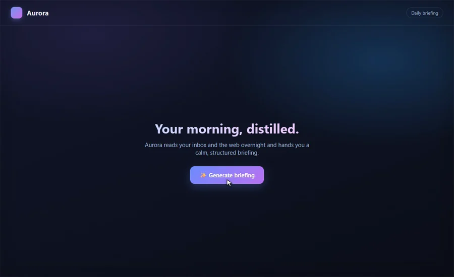
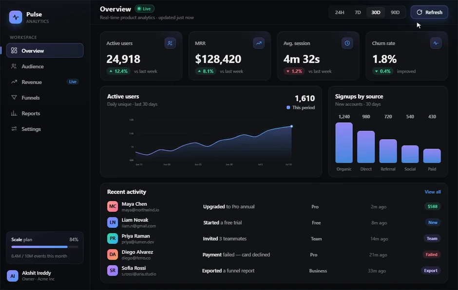
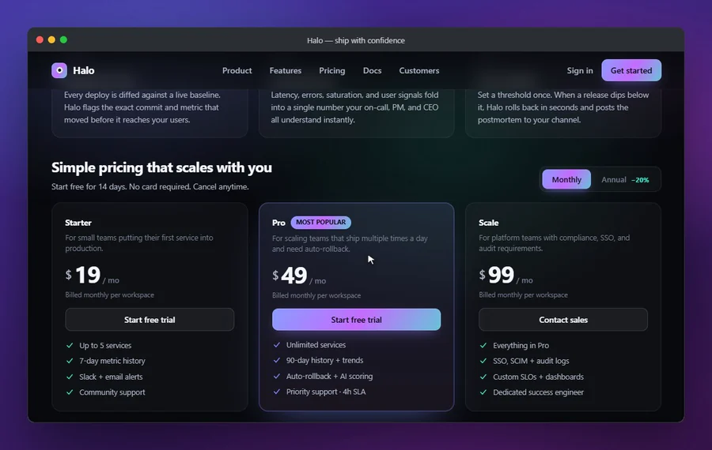

<div align="center">

# gifsmith

### A movie-set framework for **browser/app demo GIFs** & WebPs

Script a walkthrough of any web (or webview-desktop) UI as a declarative timeline, and get a tiny, smooth, **seamless forward-looping** README GIF/WebP. Like [vhs](https://github.com/charmbracelet/vhs), but for GUI apps.



<sub>↑ generated by gifsmith from the bundled example — <code>npm run example</code></sub>

</div>

---

gifsmith is a **framework, not a one-shot recorder**. Capture and encode are commodity (and bundled); the value is the direction model: a **movie set** (stage, props, camera, a synthetic cursor), a **declarative timeline** that makes multi-phase scenes tractable, an **app-cooperation bridge** to drive your product's real engine, a **seamless forward loop** (no ping-pong reversal), **natural pacing** (holds breathe, motion flows), and **AI-agent authoring ergonomics** so a coding agent can build and self-correct a demo without eyeballing a video.

```ts
import { render, timeline, web } from 'gifsmith';
import { cursor, bezel } from 'gifsmith/props';

const tl = timeline((t) => {
  t.waitFor('.app');
  t.hold(1.4);
  t.loopAnchor();            // the neutral state the scene returns to
  t.click('.generate');      // drive the real UI
  t.waitFor('.card');
  t.hold(1.7);
  t.click('.card');
  t.scroll('.content', 460, 3.0);   // slow, eased read-scroll
  t.drag('.divider', { dx: -160 }, 1.1); // real pointer drag — resize handles, sliders
  t.scroll('.content', -460, 1.6);
  t.click('.back');          // ...back to where we started
  t.hold(1.5);
});

await render({
  target: web('http://localhost:5173'),
  out: 'docs/demo.gif',
  alsoEmit: ['webp'],
  props: [cursor(), bezel()],
  timeline: tl,
  encode: { width: 900, fps: 16, speed: 1.35, targetMB: 4 },
});
```

## Why this exists

"Web page → GIF" is a crowded space (see [Alternatives](#alternatives)). gifsmith aims at the intersection that none of them combine:

1. **A movie-set direction model** that drives the app's own internals and composes a staged environment *around* the real UI — not passive pixel capture.
2. **A seamless _forward_ loop** — a half-period self-crossfade (or a scripted-anchor trim), never a boomerang that reverses your motion.
3. **Natural pacing** from real per-frame timestamps — holds hold, motion flows — instead of a robotic constant-fps sampling.
4. **AI-author ergonomics** — every build helper returns structured JSON, plus an MCP server, so an agent (Claude Code, etc.) drives it as tools.

## Install

<sub>Changes in each release are in [CHANGELOG.md](CHANGELOG.md); every GitHub Release carries its section inline.</sub>

```bash
npm i -D gifsmith
```

Two things gifsmith uses but does **not** bundle (both are large native binaries you likely already have):

- A **Chromium-based browser** — Chrome / Edge / Brave, auto-detected. (No Chromium download; it depends on `puppeteer-core`.) Or set `PUPPETEER_EXECUTABLE_PATH`.
- **[ffmpeg](https://ffmpeg.org/)** on your `PATH` (or `FFMPEG_PATH`).

Check your setup: `npx gifsmith doctor`.

## The mental model — a movie set

| Primitive | What it is |
|---|---|
| **Stage** | the canvas: viewport size, DPI, background/theme |
| **Actors** | things that move — driven by gifsmith's tween system or your app's real engine |
| **Props** | reusable set-pieces: mock desktop, window frames, taskbar/dock, a synthetic cursor (`gifsmith/props`) |
| **Camera** | a clip/zoom region, so you capture a framed sub-view |
| **Timeline** | the heart: ordered beats with `hold`, named `cue`s, `parallel`/`sequence`, and a `loopAnchor` |
| **Director** | orchestrates connect → compose scene → run timeline while capturing → loop → encode |
| **Bridge** | a `window.__demo` handshake your app *opts into*, to expose state setters, actions, and a pace multiplier |

The declarative timeline is the direct fix for the usual demo-scripting failure: choreographing imperatively with racing promises. `"app does X, then the characters move"` becomes a readable, reproducible, introspectable list of beats.

## The seamless forward loop

Two strategies, auto-picked:

**Scripted-anchor trim** (`loop: 'anchor'`) — if your timeline marks a `loopAnchor()` (a neutral hold the scene returns to), gifsmith finds the best hold-to-hold seam by grayscale-thumbnail frame-MSE and trims to it. **Zero blending artifacts** — the last frame *is* the first frame. Best for scripted product demos. (The bundled example loops with a seam MSE of ~0.08.)

Among seams that are equally invisible, the **longest** wins. Lowest-MSE alone is the wrong rule for a walkthrough: the scene holds still on its neutral pose for a beat after `loopAnchor()`, every pair of frames inside that hold matches almost perfectly, and the search would hand back `minCycleSeconds` of a motionless screen and drop the tour. If several wraps are indistinguishable, you want as much of the scene as possible.

Raise the floor when the whole walkthrough should survive:

```ts
loop: { strategy: 'anchor', minCycleSeconds: 30 }   // never return less than 30s
```

**Half-period self-crossfade** (`loop: 'crossfade'`) — for continuously-evolving/ambient motion that never returns to a pose, gifsmith blends each frame with its half-period counterpart under a raised-cosine weight:

```
out[i] = w[i]·frame[i] + (1 − w[i])·frame[(i + N/2) mod N]
w[i]   = 0.5·(1 − cos(2π·i/N))
```

`w` is 0 at the seam and 1 at the midpoint, so near the wrap the frame is dominated by the half-shifted stream — which is continuous across the loop point — and the result is mathematically periodic in `N` frames, with motion always moving **forward**. Slight ghosting on fast motion, so keep choreography gentle (calm reads better anyway).

`loop: 'auto'` (default) picks `anchor` when a `loopAnchor()` exists, else `crossfade`.

## Natural pacing

gifsmith captures with a CDP **screencast** (real paints, high fps) and keeps each frame's real timestamp. It builds an ffmpeg concat list with **per-frame durations**, then resamples to a uniform clock — so a 2-second hold becomes ~2 seconds of frames (which the palette encoder compresses to almost nothing) and motion keeps its true rhythm. A tiny injected **heartbeat** guarantees frames keep flowing during otherwise-static holds, so their duration is timed accurately.

## Deterministic capture — render it, don't record it

The screencast is honest: it records what actually happened, stalls included. If the app blocks its main thread for a second opening a panel, that second is in the GIF, and the same demo rendered on a busy laptop judders.

`capture: 'deterministic'` removes the machine from the equation. gifsmith replaces the page's clock with Chromium's **virtual time** and spends it one frame at a time, taking an explicit screenshot per frame:

```ts
await render({ target: web(url), out: 'demo.gif', timeline: tl,
  capture: 'deterministic',           // or the CLI: --capture deterministic
  encode: { fps: 16, speed: 1.35 } });
```

`performance.now()`, `Date.now()`, `setTimeout` and `requestAnimationFrame` all follow it, so animation advances exactly one frame per budget — while a main-thread stall burns real seconds and ~zero virtual ones and never reaches a frame. Render time stops being playback time, the way it works in an offline renderer. Timestamps are exact multiples of the frame interval **by construction**, and `speed` is folded into the scene-time frame interval at capture, so no resampling stage ever drops or duplicates a frame.

On the bundled example: screencast → 13.75s of output for a walkthrough designed to be 9.4s, the extra 4s being capture overhead the recording faithfully preserved. Deterministic → 9.38s, the designed length, with the same loop-seam quality (MSE 0.087).

On a real one — a 90-second product tour of a WebGL desktop app, running under SwiftShader with no GPU at all, which is about the least forgiving thing you can point this at — 1336 frames came out at exactly 14fps, a 1209-frame anchor loop with a seam MSE of 0.054, and a scene length within a few percent of the sum of its own holds. The capture ran at 3.9 frames per real second — about six minutes to render ninety seconds of walkthrough. That is the trade in one line: you wait, and the machine's mood is nowhere in the result.

### `t.call()` gets the clock too

Every non-trivial scene waits inside a callback — blur the editor, press a key, let the animation run. Written the only way JavaScript knows, that is a `setTimeout`, and a `setTimeout` measures the *machine*: the one thing this backend exists to remove. Under a virtual clock it is worse than inaccurate, because those milliseconds buy **zero rendered frames** — the animation you were waiting for is not mistimed, it is absent.

So the callback receives the scene clock as a second argument:

```ts
t.call(async (page, ctx) => {
  await ctx.settle(page.evaluate(async () => { await app.ready; }));  // wait on the page
  await page.keyboard.press('ArrowRight');
  await ctx.advance(1900);      // 1900ms of SCENE time — 24 rendered frames at 14fps
});
```

| | real clock (screencast) | virtual clock (deterministic) |
|---|---|---|
| `ctx.advance(ms)` | `setTimeout(ms)` | exactly `ms / frameMs` rendered frames |
| `ctx.settle(p)` | `await p` | starts `p`, then walks the clock forward under it |
| `ctx.nowMs()` | wall time since capture began | scene time since capture began |

**The one-argument form is untouched.** `t.call(async (page) => …)` keeps working exactly as before, on both backends — an ignored second argument is just an ignored argument.

`ctx.settle` is the interesting one. An awaited async `page.evaluate`, a `waitForSelector`, an in-page tween: each can only resolve if the page keeps painting, so awaiting one against a stopped clock is a deadlock **with no timeout attached** — the render hangs rather than fails. `settle` inverts it: start the work, then spend scene time underneath it until it settles or the cap runs out, and on the cap it throws with the step's name in the message.

Four things make sure a callback can never fail silently under the virtual clock, and none of them exists on the real one:

- **`ctx.settle` throws** when its scene-time cap runs out, naming the step and what it was waiting for.
- **A stall watchdog** fails the render if a callback goes 30s of real time without asking the clock for anything — which is what a genuine deadlock looks like from outside. It names the step and shows the fix. (It does not fire while the clock is being spent, so a legitimate `ctx.advance(20_000)` on a slow render is never mistaken for a hang.)
- **`ctx.advance` fails on a dead clock.** If capture stops advancing under it — a dead frame pump, a detached CDP session — it says so and names the step, rather than walking toward a target that will never arrive. This is the one stall the watchdog above cannot see, because `advance` is what keeps petting it.
- **A raw `setTimeout` is reported.** Any single stretch of real time the callback spends without asking the clock for anything renders zero frames, so gifsmith says so afterwards with the step's name and the number to pass to `ctx.advance` — including in the common shape where the callback advances first and *then* sleeps.

Name your callbacks if you have more than a couple — every one of those messages quotes the label, and `call#7` is a poor thing to be told about at minute three of a render:

```ts
t.call(async function turnThePage(page, ctx) { /* … */ }); // named function
t.call(fn, { name: 'seed the shelf' });                    // or say it outright
t.call(fn, { seconds: 2 });                                // and how long it holds the scene
```

`seconds` is the callback's share of the *planned* duration. A `call` counted as zero for as long as a callback had no way to spend scene time; now that `ctx.advance` is how you wait, a deterministic scene can be mostly callbacks, and `dryRun()`'s `totalPlannedSeconds` would report a fraction of its real length. Nothing but the author can know the number — `dryRun` says how many callbacks have not declared one rather than quoting a confident wrong total.

`expectStable(page, region, ms, ctx)` takes the context for the same reason — without it the wait between its two screenshots is real time, the scene is frozen across both, and every region is trivially stable.

The trade-offs, stated plainly:

- **It is slower.** Three CDP round trips per frame; the example takes ~20s to render 9.4s of GIF. It is offline, so this is a fine price — but progress is logged so it doesn't look like a hang.
- **CSS animation is fine.** This README used to claim a virtual clock only overrides JS timers and freezes CSS transitions. Measured on current Chrome, that is not true: CSS `transition` and `@keyframes` both advance with virtual time, and the example's card stagger is captured mid-fade. (One real gotcha, handled internally: `requestAnimationFrame`'s *timestamp argument* is on the compositor's clock, not the virtual one — mixing it with `performance.now()` makes every tween complete in a single frame.)
- **`compose: 'stage'` is refused.** Virtual time is granted per target, and a framed app is its own renderer with its own clock. So is a `capture` gifsmith does not recognise — a mode it cannot honour used to fall through to the screencast, so a deterministic render silently became a recorded one.
- **A capture that stops advancing fails the render.** If the page or its CDP session goes away mid-scene the pump releases the timeline rather than hanging it, and the remaining steps run out against a frozen scene — which produces a perfectly good GIF of half a walkthrough. That is reported as an error, not a warning.
- **Attach mode warns.** You would be freezing a real running app's clock, and it must have been launched with `--run-all-compositor-stages-before-draw` (gifsmith passes that itself in launch mode).

## Quality — where a demo GIF actually loses its picture

> *"I feel this gif is very lossy. When it is showing the gif, it is not always the same spot that gets messy."*

That second sentence is the diagnosis. A fixed artefact is a compression artefact; a mess that **moves** is a dither, re-rolled against a palette that was chosen from the pixels that change. gifsmith's defaults are tuned for size, which is right for a README GIF, and the cost is a picture that is approximated worst wherever the motion is. There are exactly two lossy stages, and it is worth knowing which is which before turning knobs.

Everything below was measured on one real render: a 90-second walkthrough of a hand-drawn desktop app — warm cream paper, fine ink lines, flat colour — captured deterministically at 1360×850 and encoded at 900px, 14fps. **PSNR and SSIM are against the frames the encoder was given**, so each number is that stage's own damage and nothing else. (Two runs of the same demo cannot be compared for this: the app seeds some of its art per run, and a handful of frames legitimately differ.)

**The capture stage** — 1336 frames, measured against exactly what Chromium composited:

| capture frames | on disk | vs. what the browser drew | the default GIF that comes out |
|---|---|---|---|
| `format: 'jpeg'`, quality 92 (default) | 285 MB | 45.40 dB · SSIM 0.991 | 14,572,788 B |
| `format: 'png'` | 489 MB | lossless | **11,481,042 B** |

The lossy option produces a **27% bigger** GIF. That is not a paradox: JPEG ringing around dark ink on pale paper is high-frequency noise in a picture that had none, and noise is the one thing neither a palette nor an inter-frame compressor can do anything with.

**The encoder** — the finished 1209-frame loop, from lossless frames:

| encode | bytes | PSNR | SSIM |
|---|---|---|---|
| `colors: 128, dither: 'bayer', palette: 'diff'` (defaults) | 11,271,990 | 37.06 dB | 0.971 |
| `colors: 256, dither: 'bayer', palette: 'diff'` | 13,345,194 | 39.35 dB | 0.977 |
| **`colors: 256, dither: 'none', palette: 'full'`** | **11,985,540** | **40.29 dB** | **0.992** |
| `colors: 256, dither: 'none', palette: 'perFrame'` | 162,892,951 | 43.69 dB | 0.996 |
| WebP `quality: 88` (default) | 6,323,962 | 38.16 dB | 0.983 |

The recommended row costs **6% more bytes than the default and is 3.2 dB better**, because on flat-colour art the dither was only adding the noise it exists to hide. A per-frame palette buys another 3.4 dB for a 163 MB file — **fourteen times** the default's size. That is the ceiling of what GIF can do, and it is not a README.

On the quietest part of the same demo — 300 frames of a two-page spread, which is the content the complaint was actually about — the trade is even more lopsided:

| encode (300-frame spread) | bytes | PSNR | SSIM |
|---|---|---|---|
| defaults | 3,362,546 | 41.39 dB | 0.981 |
| `colors: 256, dither: 'none', palette: 'full'` | 3,373,170 | **46.06 dB** | **0.997** |
| WebP `quality: 88` | 1,546,546 | 40.38 dB | 0.987 |
| WebP `lossless: true` | 4,563,456 | ∞ | 1.000 |

**+0.3% bytes for +4.7 dB.** If your demo is a user interface rather than video, the defaults are leaving that on the table.

### 1. The frames (`capture: { format: 'png' }`)

Captured frames are JPEG at quality 92 — lossy before the encoder has seen anything. `format: 'png'` removes that stage, and under `capture: 'deterministic'` (which has no resample step) it makes the pipeline **lossless end to end**: the quantiser sees exactly the pixels Chromium composited.

The surprise is that it is also *smaller*. JPEG's ringing around dark ink on pale paper is high-frequency noise in a picture that had none, and noise is the one thing neither a palette nor an inter-frame compressor can do anything with.

On the screencast backend this is a real trade rather than a free win: PNG frames are several times larger to encode, so the capture delivers fewer paints per second, and a capture rate below the output fps is visible as steppy motion — worse than the loss it removes. Check `achievedCaptureFps` before keeping it.

### 2. The palette (`colors`, `dither`, `palette`)

A GIF has at most 256 colours per palette, and how you spend them is most of the picture:

- **`colors`** — 128 by default. 256 costs a few percent and is nearly always worth it.
- **`dither`** — `'bayer'` by default, and the default is load-bearing for size: an ordered dither holds its pattern still frame-to-frame, so inter-frame compression keeps working (on a text UI, ~2MB instead of ~25MB). The error-diffusion kernels look better on one frame and cost enormously more in an animation, because the diffused error re-rolls every frame and turns a still background into noise that never repeats. **`'none'` is the right answer for flat-colour art** — there are no gradients to break up, so the dither was only adding the noise it exists to hide.
- **`palette`** — `'diff'` (default) weights the shared palette toward what moves; `'full'` weights it by the whole picture, so the quiet 90% of a UI demo gets its fair share of the slots; `'perFrame'` gives every frame its own palette, which is as good as GIF gets and costs about ten times the bytes.

### When WebP beats GIF

GitHub renders animated WebP inline, so for a README this is a live choice rather than a compatibility hypothetical — and `alsoEmit: ['webp']` produces both from the same frames.

- **Lossy WebP (`quality`, default 88)** is the smallest of everything here by a wide margin, and its loss is *smooth* — a slight softening rather than moving grain. Reach for it when the file size is the constraint.
- **Lossless WebP (`lossless: true`)** keeps every pixel exactly — verified above, PSNR ∞ and SSIM 1.000, not asserted — and costs 1.35× the best GIF of the same clip while being perfect rather than 46 dB. Flat fills, text and hard edges are what its predictors are for, and there is no palette to fight. If a demo is a screen recording of an interface, this is the quality answer. **Budget the time**: lossless animated WebP is slow, and slow in a way that does not scale gently. 300 frames took about six minutes; the full 1209-frame loop had not finished after an hour and was abandoned. Encode the GIF and the lossy WebP for the README, and reach for lossless on short clips.
- **GIF** is the one everything renders, everywhere, forever. Keep emitting it; tune it with the knobs above; and let the WebP be the good-looking one.

The trade reverses on photographic or gradient-heavy footage, where lossless WebP is enormous and the GIF's palette was never going to cope either — use lossy WebP and accept the GIF as a thumbnail.

```ts
// The high-quality render, end to end.
await render({
  target: web(url), out: 'docs/demo.gif', alsoEmit: ['webp'], timeline: tl,
  capture: { mode: 'deterministic', format: 'png' },   // lossless frames
  encode: { width: 900, fps: 14, colors: 256, dither: 'none', palette: 'full' },
});
```

```bash
gifsmith render demo.config.mjs --frame-format png --colors 256 --dither none --palette full
```

## Props

```ts
import { cursor, bezel, desktop, wallpaper, taskbar, mockWindow } from 'gifsmith/props';

props: [
  ...desktop({ os: 'windows' }),                 // wallpaper + taskbar
  mockWindow({ kind: 'code', x: 60, y: 80, width: 520, height: 340 }),
  cursor({ start: { x: 600, y: 470 } }),
  bezel(),
]
```

Props composite with the *live* app in the same paint (back-layer props behind, front-layer on top). The synthetic **cursor** is driven by `cursorTo` / `click(via:'cursor')` and glides with real easing; click glides are **distance-aware** by default (~900px/s, clamped), so long travels stay watchable instead of teleporting — pin an exact time with `click(sel, { glideSeconds })`.

The **taskbar** renders a convincing populated desktop, not placeholders: original SVG app-icon glyphs (start, search, folder, globe browser, code editor, terminal, mail) plus, on Windows, a system tray — chevron, wifi, speaker, battery — beside the clock. `taskbar({ clock: '10:24', date: '7/13/2026' })` pins the time; the mac dock reuses the same icon set.

## Built for AI authors

Every build-time helper returns structured data — an agent can build and self-correct without watching a video:

```ts
import { probe, dryRun, snapshot, contactSheet, expectVisible } from 'gifsmith';

await probe({ target: web(url) });          // DOM map: selectors + bounding boxes, bridge status
await dryRun(scene);                        // selectors resolve? loop anchor? planned duration?
await snapshot(scene, 4.2);                 // one frame at t=4.2s (base64 PNG) — "see" a moment
await contactSheet(scene, 6);               // a tiled grid of N frames for one-shot visual QA
```

`render()` returns achieved fps, frame counts, output bytes, loop-seam MSE, and actionable warnings. Assertions (`expectVisible`, `expectStable`, `expectInFrame`) run inside a `t.call()` step so a broken scene fails loudly instead of shipping a blank GIF.

All four take the same scene object you pass to `render()`, `capture` included. `dryRun` enforces the capture rules `render` does — an unrecognised `mode`, or `deterministic` with `compose: 'stage'` — so the config error costs a dry run instead of a capture. `snapshot` and `contactSheet` accept the field and play the timeline on the **real** clock regardless (they are a look at the app, not a render); they say so once when the scene asks for `deterministic`, because the moment you seek to is then a planned one rather than a rendered one.

There's also an **MCP server** (`gifsmith-mcp`, experimental) exposing `probe` / `dry_run` / `contact_sheet` / `snapshot` / `render` as tools:

```bash
npm i @modelcontextprotocol/sdk      # only if you want gifsmith-mcp
```

The SDK is an **optional peer dependency**, and that phrasing is doing real work. It sat in `optionalDependencies` for a release, which reads like "opt in" and is not what npm means by it — npm installs optional dependencies *by default*, and "optional" only promises to tolerate one that fails to install. The result: `npm i gifsmith` handed every consumer of a 300 KB GIF library **170 packages and 49.5 MB**, including express, hono, `@hono/node-server` and cors, for a feature most of them will never run. As an optional peer it is 85 packages and 35 MB, all of it puppeteer-core, and `gifsmith-mcp` prints the one-line install command if you run it without the SDK. Nothing else in gifsmith touches it — the library, the `gifsmith` CLI and every render path work without it, which is why it can be loaded lazily at all.

## CLI

```bash
gifsmith render demo.config.mjs --width 900 --fps 16 --also-webp
gifsmith probe  http://localhost:5173 --json
gifsmith doctor
```

A config module default-exports a `RenderConfig` (the timeline is authored in code — vhs-`.tape` in spirit, fully programmable). CLI flags override its encode/loop options.

Flags are read *before* the config path, and every value is checked against what it can actually be — so `--capture Deterministic`, `--loop crossfde` and `--fps 0` are refused by name rather than rendering something plausible and wrong. A mistake in the command line, or a value in the config gifsmith cannot honour, is **one line and exit 2**; a missing ffmpeg or browser is one line and exit 1; anything else keeps its stack, because that one is a bug. A config module that cannot be *loaded* — a syntax error, an import that does not resolve, a `.ts` path — is a mistake too, and names the file; a config that loads and then throws keeps its stack, because that failure is the author's to debug. The same rules run inside `dryRun()`, which reports them all at once instead of throwing on the first.

Every boolean flag can be written bare or as `--flag true|false`, and an explicit `false` beats a config that said `true`. The two exceptions are `--debug` and `--quiet`: they are shortcuts onto `logLevel`, which has four levels rather than two, so "not debug" does not name one of them — `--debug false` means "not asking", and the config's own `logLevel` stands. Given both, `--quiet` wins.

## Adapters

```ts
import { web, tauri, electron } from 'gifsmith';

web('http://localhost:5173')       // launch a detected browser (the supported v1 path)
tauri({ port: 9222 })              // attach to a running Tauri (WebView2) app
electron({ port: 9222 })           // attach to a running Electron app
```

For webview apps, launch with a remote-debugging port first. On **Windows/WebView2** the non-obvious gotcha is `--remote-allow-origins=*` — without it the CDP WebSocket 403s:

```powershell
$env:WEBVIEW2_ADDITIONAL_BROWSER_ARGUMENTS = "--remote-debugging-port=9222 --remote-allow-origins=*"
Start-Process .\your-app.exe
```

The [Cadence/Electron example](examples/electron-app/) is a complete, runnable attach recording (launch → attach → record) — the same flow applies to Tauri.

## Size budgeting & gotchas

- Knobs: `width`, `fps`, `speed`, `colors` (GIF palette), `quality` (WebP), `targetMB` (warns if exceeded); `camera` clips output to a sub-region. For the quality knobs — `dither`, `palette`, `lossless`, and PNG capture frames — see [Quality](#quality--where-a-demo-gif-actually-loses-its-picture), which has measured numbers for each.
- **Bayer (ordered) dither** for GIF by default, not error-diffusion — it keeps a static pattern frame-to-frame so inter-frame compression stays effective (the difference between ~25 MB and ~2 MB on a text UI).
- **WebP** is smaller and cleaner than GIF for modern READMEs; gifsmith emits both (`alsoEmit: ['webp']`). GitHub renders animated WebP inline.
- **Animated backgrounds wreck compression** — prefer a quiet background while recording.
- gifsmith runs headless/off-screen and muted, and never persists app state; if you toggle real state for a shot, restore it around the capture.

## Composition modes

`overlay` (default) drives the app at top level and injects props as DOM layers — robust for any app, and the full movie set for transparent/overlay apps.

`stage` renders the app inside an `<iframe>` as a **window on a mock desktop** (wallpaper + a titled window). The app is driven inside the frame — Puppeteer handles it even cross-origin — while the synthetic cursor and props live on the top page, with cursor coordinates mapped through the iframe offset. Stage mode needs an http(s) target (a dev server); a `file://` app can't be framed by a non-file page. See the [Halo example](examples/halo/).

```ts
await render({ target: web('http://localhost:5173'), out: 'demo.gif',
  compose: 'stage', stage: { title: 'My App', os: 'mac' }, timeline: tl });
```

The stage reserves space under the window (`stage.bottomInset`, default 72px windows / 84px mac) so a `taskbar()`/dock prop never overlaps the app and a strip of desktop stays visible between them — a window sitting flush on the taskbar reads as a bug, not a desktop. Set `bottomInset: 0` to restore the old edge-to-edge layout.

## Sandbox & isolation

gifsmith always renders in an **isolated, throwaway browser profile** — a fresh `userDataDir` it creates under a temp work dir and deletes afterwards — so a capture never reads or writes your real browser's cookies, session, or history. It runs headless, muted, and (headful) off-screen. For CI/containers, set `chromiumSandbox: false` on the target (adds `--no-sandbox`), and there's a [`Dockerfile`](Dockerfile) for hermetic, host-independent rendering (Chromium + ffmpeg baked in).

## Examples

A gallery of self-contained demos, each showing a different capability — see [`examples/`](examples/) for the full set and runnable sources.

| Demo | Shows |
|---|---|
| [Aurora](examples/hello-web/) | overlay mode · anchor loop · synthetic cursor |
| [Pulse](examples/pulse/) | cursor journey · re-animated dashboard · anchor loop |
| [Halo](examples/halo/) | **stage mode** — app as a window on a desktop |
| [Forge](examples/forge/) | **camera clip** on a CI pipeline · crossfade loop |
| [Cadence](examples/electron-app/) | the **`electron()` attach adapter** — a real Electron app, end-to-end |

<p>
  
  
</p>

## Built with gifsmith

README demos from shipped apps — scripted walkthroughs of the real UI, looped forward, usually a few MB each.

<p align="center">
  <a href="https://github.com/AkshitIreddy/Alcove"></a>
  <br><sub><b><a href="https://github.com/AkshitIreddy/Alcove">Alcove</a></b> — notes in books on a shelf you can move around in · 77&nbsp;s loop, anchor seam MSE&nbsp;0.115</sub>
</p>

<table>
<tr>
<td width="50%" align="center" valign="middle">
<a href="https://github.com/AkshitIreddy/convai-desktop-pet"></a><br>
<sub><b><a href="https://github.com/AkshitIreddy/convai-desktop-pet">ConvAI Desktop Pet</a></b> — desktop companions</sub>
</td>
<td width="50%" align="center" valign="middle">
<a href="https://github.com/AkshitIreddy/keyscape"></a><br>
<sub><b><a href="https://github.com/AkshitIreddy/keyscape">Keyscape</a></b> — per-key RGB lighting</sub>
</td>
</tr>
<tr>
<td width="50%" align="center" valign="middle">
<a href="https://github.com/AkshitIreddy/Email-Briefing"></a><br>
<sub><b><a href="https://github.com/AkshitIreddy/Email-Briefing">Email Briefing</a></b> — inbox dashboards</sub>
</td>
<td width="50%" align="center" valign="middle">
<a href="https://github.com/AkshitIreddy/compendium"></a><br>
<sub><b><a href="https://github.com/AkshitIreddy/compendium">Compendium</a></b> — cited technique advisories</sub>
</td>
</tr>
</table>

## Alternatives

Honest landscape — reach for these when they fit better:

- **[vhs](https://github.com/charmbracelet/vhs)** — the gold standard for *terminal* demos via `.tape` scripts. Explicitly punts on the browser; gifsmith is the GUI analogue.
- **[Remotion](https://www.remotion.dev/)** — programmatic video in React. Heavier; for authored motion graphics, not "capture my real app looping."
- **[timecut](https://github.com/tungs/timecut) / [timesnap](https://github.com/tungs/timesnap)** — deterministic virtual-clock capture of a page. gifsmith has the same clock available (`capture: 'deterministic'`) but as one backend inside the direction model, rather than as the whole product.
- **[pagecast](https://github.com/lucasfernog/pagecast), [capture-website](https://github.com/sindresorhus/capture-website), puppeteer-screen-recorder** — solid page → gif/video recorders. No direction model, no seamless forward loop, no AI-author surface.
- **Native `page.screencast()`** — Puppeteer now emits GIF directly. Perfect for a quick clip; not a movie set or a loop.

gifsmith deliberately reuses the good parts (CDP screencast, ffmpeg palette) and adds the direction model, the forward loop, natural pacing, and the agent ergonomics on top.

## Tests

```bash
npm test        # builds, then runs node:test over dist/
```

No framework and no new dependency — `node --test` over the built output. It covers the parts that can be checked without a browser, which is a deliberately small set: the **clock seam**'s real-clock behaviour (the default path is defined as "what the player did before the seam existed", and that is only true if it stays true), the **frame scheduler**'s arithmetic (one frame per frame interval, no drift after thousands of sub-frame advances, a `parallel` beat costing the longest branch and not the sum), the **call context** and its four anti-hang guards, the **anchor search**'s lowest-MSE-then-longest-span rule, that the **encode options** reach the ffmpeg filter chain they claim to, that the **CLI flags** are read as the kind of thing they are, that the **MCP server** answers a real handshake, and what the **package** actually ships and costs to install.

Two of them are worth calling out because they check things a unit test cannot. The **CLI is spawned as a process** for every flag — exit code and output — after a green unit test asserted a fix the shipped command never reached. And **every TypeScript example on this page is extracted and compiled** against the shipped `dist/*.d.ts` under `strict: true`, because the `t.call` example above once did not typecheck: `PageCallback` declared `page: unknown`, so the flagship feature's documented snippet failed with `TS18046` on its first line.

Those are all things that fail *invisibly*: a scheduler that drifts renders a GIF that looks fine and is a frame short every second; `--bayer-scale` with its value left off rendered at scale 1 and printed a result that looked normal; a tarball that installs an HTTP server stack is a clean build with a green suite. Everything downstream of a browser is exercised by `npm run example`, which renders the bundled demo end to end.

[`.github/workflows/ci.yml`](.github/workflows/ci.yml) runs the suite on every push and pull request, on Node 18 (the `engines` floor) and 24, and separately packs the tarball and counts what a clean `npm install` of it actually pulls in. [`release.yml`](.github/workflows/release.yml) runs the same suite before it is allowed to publish — the suite is this release's headline addition, and for most of its development nothing ran it: the release workflow was install → build → verify tag → pack → publish, with no `npm test` anywhere, so the pipeline could have published a red suite and reported success.

## Releasing

Releases are automated with [npm trusted publishing](https://docs.npmjs.com/trusted-publishers/) (OIDC) — there is no `NPM_TOKEN` in this repository, and no manual `npm publish`. Pushing a `v*` tag runs [`.github/workflows/release.yml`](.github/workflows/release.yml), which builds, **runs the test suite**, verifies the packed tarball actually installs, imports and does not drag in anything it should not, and publishes with [provenance](https://docs.npmjs.com/generating-provenance-statements).

```bash
npm version patch      # bumps package.json + lockfile, creates the v* tag
git push --follow-tags # -> builds, verifies, publishes
```

That publishes to npm **and** creates the GitHub Release. Two other modes, from **Actions → release → Run workflow**:

| Run | Result |
|---|---|
| Push a `v*` tag | publish to npm + create the Release |
| Manual, **with** a tag | publish that tag to npm only — for when the tag/Release already exists and npm is behind (tick `github_release` to cut the Release too) |
| Manual, **no** tag | build and verify only, publishes nothing |

The workflow refuses to publish if the tag and `package.json` version disagree, and every step is idempotent — a version already on npm is skipped and an existing Release is left untouched — so re-running is always safe.

## Roadmap

A richer MCP surface · more prop kits · deeper Tauri recipes · per-actor camera tracking.

## License

MIT © Akshit Ireddy
