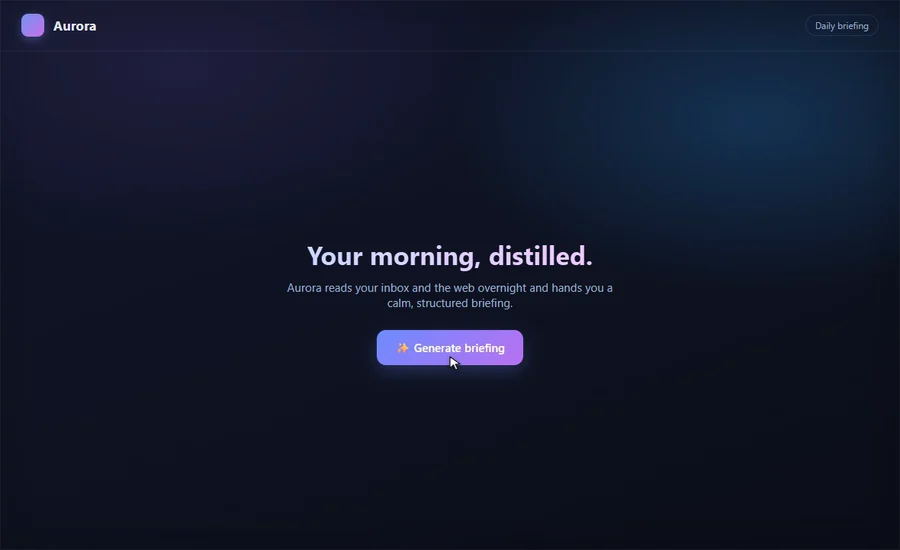
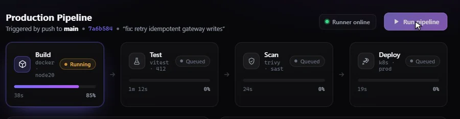
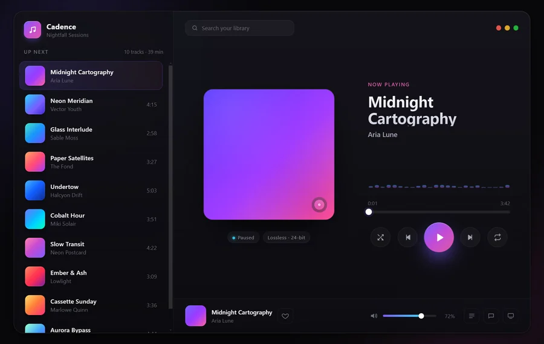

# gifsmith examples

Each folder is a self-contained demo that showcases a different gifsmith
capability. The apps are hand-built **premium** UIs — single HTML files, no
build step, no external resources — and each `demo.mjs` renders the looping
WebP shown below.

```bash
npm run build                              # from the repo root, once
# stage mode (Halo) needs the apps over http; overlay demos work either way:
( cd examples && python -m http.server 8266 )
node examples/pulse/demo.mjs               # -> examples/pulse/out/demo.gif (+ .webp)
```

---

### Aurora — overlay mode · anchor loop · synthetic cursor


Idle hero → generate the briefing → open a topic → slow read-scroll → back to
the hero. The scene returns exactly to the hero, so the **anchor** loop finds a
clean seam. Runs a `file://` app in overlay mode. → [`hello-web/`](hello-web/)

---

### Pulse — overlay mode · cursor journey · re-animated anchor loop


The cursor clicks **Refresh**; the charts redraw and the KPIs count up, then
everything settles back to the same state — a clean anchor loop over a live
dashboard. → [`pulse/`](pulse/)

---

### Halo — stage mode · app-in-a-window-on-a-desktop


`compose: 'stage'` renders the landing page as a macOS-style **window on a
wallpaper desktop**. The billing toggle flips Monthly↔Annual and back, looping a
small, tightly-compressing region. → [`halo/`](halo/)

---

### Forge — camera clip · crossfade loop


A **camera clip** frames just the CI pipeline band. Clicking **Run** animates the
stages Build → Test → Scan → Deploy, and the **half-period crossfade** makes the
running animation loop forward. → [`forge/`](forge/)

---

### Cadence via Electron — the `electron()` attach adapter


A **real Electron app** (the Cadence music player) captured end-to-end: the app
launches with a remote-debugging port and gifsmith attaches with `electron()` —
no changes to the app. The ambient equalizer makes the crossfade loop seamless.
The identical flow works for **Tauri** (WebView2). → [`electron-app/`](electron-app/)

---

The premium app sources (`pulse/`, `cadence/`, `halo/`, `forge/`) are reusable
targets — point any gifsmith timeline at them.
